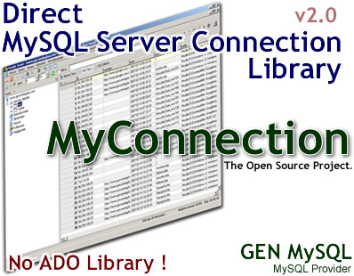



## MyConnection: MySQL Library v2\.0

### Description

No ADO Library. Direct connect to MySQL Server 5.0 or above. Use libmysql.dll(written by MySQL AB in C++) One dependecies libmysql.dll Download link:http://www.gurevin.net/dll_libmysql.rar

Optional return table convert to ADO Recordset object. (in use grid ocx's)

Full Speed Connection, pure visual basic 6.0 and libmysql.dll.

I'm sorry. My English is not good. :(

Function List:

BathRealQuery,

BathRealQueryFromFile,

BathRealQueryFromResource,

BathRealQueryFromResource,

Connect,

ConvertADORS,

DatabaseExists,

Disconnect,

EscapeString,

Execute,

ExecuteNonQuery,

ExecuteReader,

FieldExists,

FreeResult,

ListDatabases,

ListFields,

ListTables,

Ptr2Str,

SelectDatabase,

SendQuery,

TableExists.
 
### More Info
 

             |
---                |---
**Submitted On**   |2007-02-16 11:16:44
**By**             |[Mehmet Gürevin](https://github.com/Planet-Source-Code/PSCIndex/blob/master/ByAuthor/mehmet-g-revin.md)
**Level**          |Advanced
**User Rating**    |4.4 (31 globes from 7 users)
**Compatibility**  |VB 6\.0
**Category**       |[Databases/ Data Access/ DAO/ ADO](https://github.com/Planet-Source-Code/PSCIndex/blob/master/ByCategory/databases-data-access-dao-ado__1-6.md)
**World**          |[Visual Basic](https://github.com/Planet-Source-Code/PSCIndex/blob/master/ByWorld/visual-basic.md)
**Archive File**   |[MyConnecti2048092162007\.zip](https://github.com/Planet-Source-Code/mehmet-g-revin-myconnection-mysql-library-v2-0__1-67874/archive/master.zip)

### API Declarations

http://www.vbasicmaster.com (Turkish Visual Basic Portal)

